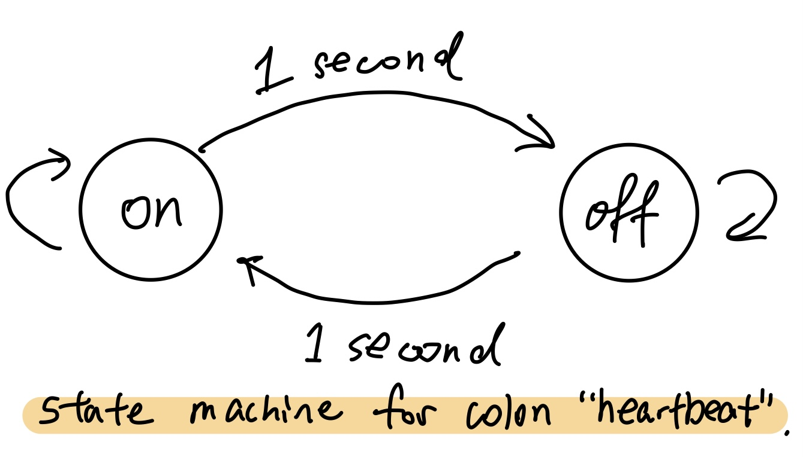
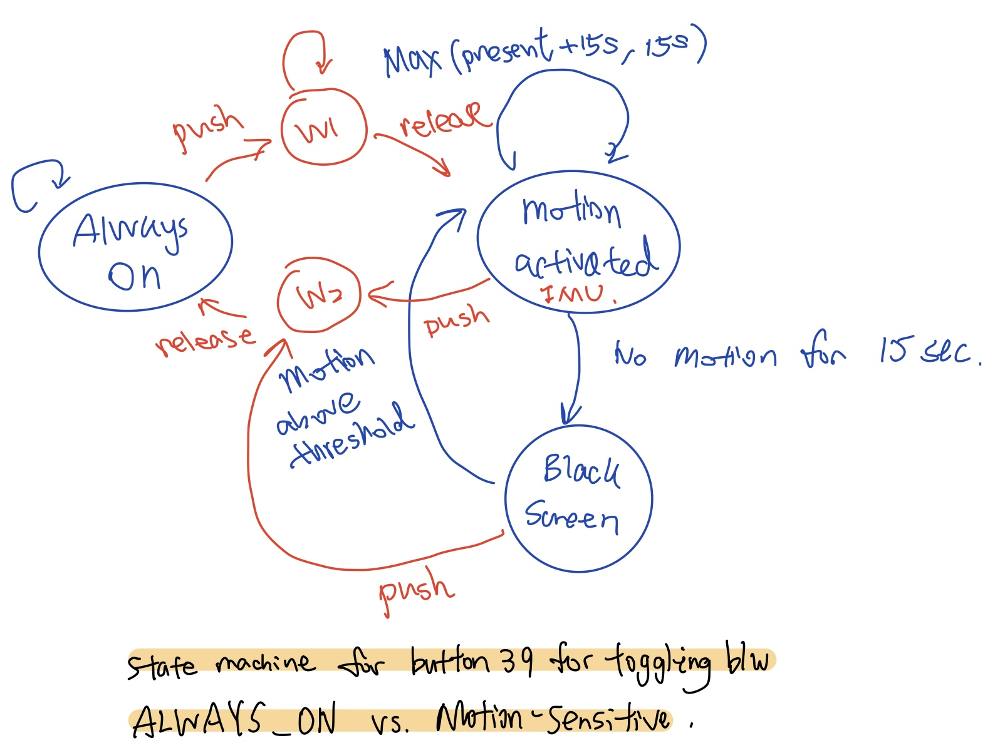

# Overview

This is a writeup for smart clock design exercise (1) that I design and build an desk/smart clock.

I will mainly discuss what each function is responsible for in section 1, and specific design desicion for all my state machines as they make up most part of the exercise in section 2.

Link to my demonstration video:
[demonstration video](https://youtu.be/yE51vaACc1Q)

# Summary

You should use your writeup as a way to help us in grading your design exercise. Our job is not to try to figure out what you did. Our job is to grade. Your job is to explain what you did and show it. 
## 1. Functions
### (a) setup()
I set up connection to IMU, screen, wifi connection, and button connections for pin 39 and 45. I also intialized a timer named `primary_timer` so that I can use this timer to do GET request once per minute in the later function.

### (b) loop()
I make the first GET request to start the smart clock. It also includes IMU setup where I take three way average of its x, y, and z-axis measurement.
I implement a state machine for switching between ALWAYS ON and MotionSensitive, which I will explain in details in section 2b, based on state of button 39 and state of current motion.

### (c) swap_face(uint8_t input, char response_buffer[OUT_BUFFER_SIZE])
This function is to swap between HOUR:MIN and HOUR:MIN:SEC mode based on the state of button 45. It takes in the button state as input and response buffer from GET request. More details of the state machine here is explained in 2c.

### (d) hour_min_increment_state_machine / hour_min_sec_increment_state_machine
Both does very similar things, but one is responsible for HOUR:MIN mode while the other is responsible for HOUR:MIN:SEC, by their names.
A state machine is implemented in each of the function to handle the case when there is a once-per-minute GET request so we can update current time, and the case when there's no GET request so we are incrementing and updating ime locally. For more, see 2e.

### (e) make_hour_min / make_hour_sec
By name, they are responsible for two different time display modes. 
`make_hour_min` has a state machine that handles colon "heartbeat", which is explained in 2a.

### (f) process_query
This is a state machine that handles states of initial GET request vs seding GET request once per minute. More detailed will be explained in 2d

## 2. State Machines
### (a) state machine for colon "heartbeat" in HOUR/MIN mode
This is implemented by a 2-state machine, written in `make_hour_min`, where it switches between "colon on" state and "colon off" state, and the transition function is whether a second has passed. 

### (b) state machine for display mode between ALWAYS ON and MotionSensitive
This is the most comlicated state machine implemented in this design exercise, in which it involves 5 states,

As shown, the start state is ALWAYS_ON, in which it loops if nothing happens, and transits to waiting_state_1 upon pushing button 39, and upon release it goes to MOTION. 

In MOTION, we loop for max(the time motion persists + 15 secs, 15 secs), and the motion is detected by IMU in loop(). 
If there is no motion for 15 sec, we switch to BLACK where it's black screen. Once there's motion, it will switch back to MOTION.

We can transit from MOTION back to ALWAYS_ON through waiting_state_2 by pushing and releasing button 39.

### (c) state machine for display mode between HOUR:MIN and HOUR:MIN:SEC mode
This is a 4-state machine that's similar to what we implemented in lab 1a. 
This is implemented in swap_face, where case ZERO is by default displaying H:M.
Upon pushing button 45, it goes to waiting stat ONE; upon releasing it switches to TWO where is shows H:M:S.
THREE, similar to ONE, handles a waiting state when the button is pressed but not released. Upon releasing, it will transit back to state ZERO and display H:M.

### (d) state machine for sending GET once per minute
This is a 2-state machine implemented in process_query. Recalling that we have initalized `primary_timer` in setup().
This comes into play by counting 10,000 ms locally to send another GET request, and reset the timer every time we do so.
The machine starts from INIT, where we just start the program, and after the first request it will go to PER_MIN to handle request per minute and keep self-looping.

### (e) state machine for updating time upon receiving a GET request vs incrementing locally
This is mentioned in 1d. It has state REQ and NO_REQ. Every time we make a request in REQ and update our clock accordingly to correct off-time error, it then goes to NO_REQ so we will keep incrementing time locally. It is associated with state machine 2d in a way that once 2d make a once-per-minute query, the state in 2e will switch to REQ.

